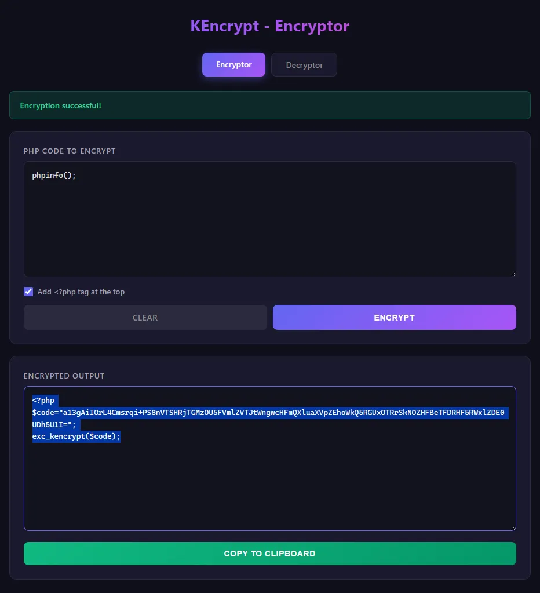
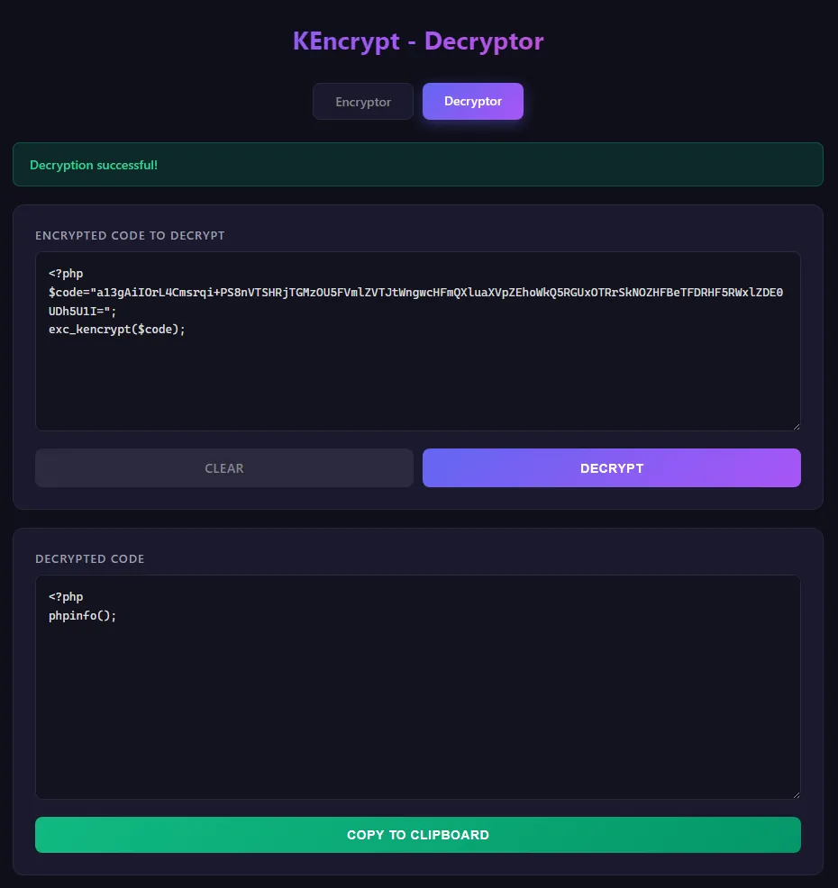

# KEncrypt - PHP Source Code Protector 🔒

KEncrypt is a custom PHP extension designed to protect your source code and intellectual property. It securely encrypts your PHP files and executes them natively.

## ⚙️ Requirements

* **OS:** Windows (x64)
* **PHP version:** PHP 8.x
* **Architecture:** Thread Safe (TS) only. (Non-Thread Safe / NTS is not supported).

> *Note: Linux files (.so) are currently in development and are not publicly available at this time.*

## 📦 Installation

1. Download the correct `.dll` file for your PHP version from the repository releases.
2. Copy the `.dll` file into your PHP `ext/` directory (e.g., `C:\php\ext\`).
3. Open your `php.ini` file and add the following line at the end:
   ```ini
   extension=kencrypt
   ```
4. Restart your web server (Apache, Nginx, etc.) for the changes to take effect. 

You can verify it loaded successfully by checking for `kencrypt` in your `phpinfo()` output.

## 🛠️ How to Use

KEncrypt includes a local GUI tool named `index.php` to easily secure your own code.(! the dll must be enabled to use the tool)

1. Drop `index.php` into your local server directory.
2. Open the file in your web browser using apache or nginx you can use xampp .
3. Paste the PHP code you want to protect.
4. Click **Encrypt** and the tool will generate a protected payload.

### 🎥 Example

Protecting a simple script:

**1. Original Code:**
```php
<?php
phpinfo();
```

**2. Using the KEncrypt Tool**

| Encryptor | Decryptor (with auto-beautify) |
| :---: | :---: |
|  |  |

**3. Output (The Protected File):**
The tool will output a scrambled payload that looks like this:
```php
<?php
$code="U3RyQ2NzM2VDK00rWVZhYWNTbzVXVkI2YUdoWWtaUjJXVkZJWWs1VGIzbHpSVlk1S0B4UGNFNWlWWGhZWlROV1RsTXpidnAxbk51WGVUcmFjazVwTVV4RU4zVTVhazlGWkdGcw==";
exc_kencrypt($code);
```

**4. Execution:**
Simply save that output anywhere as a `.php` file. The server will natively execute it seamlessly without exposing your source code!

## 🤝 Support
If you find this extension useful, feel free to star the repository!
